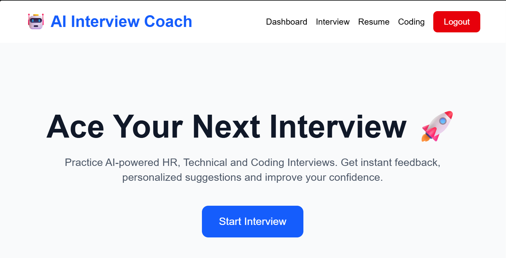
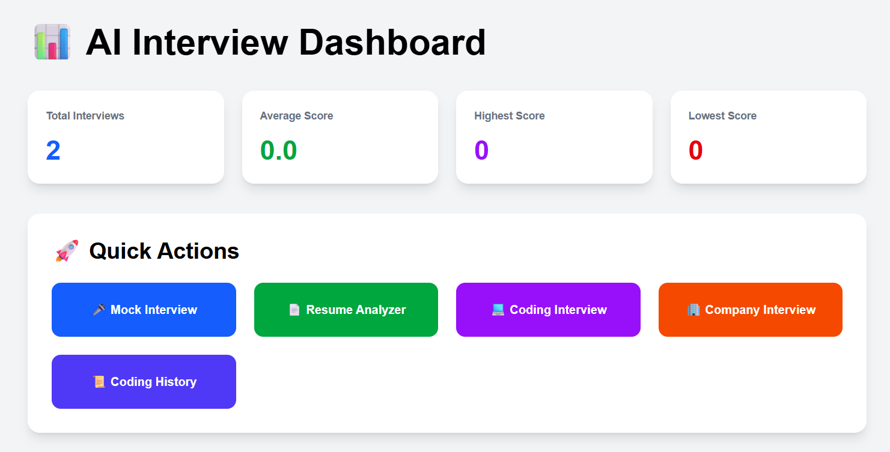
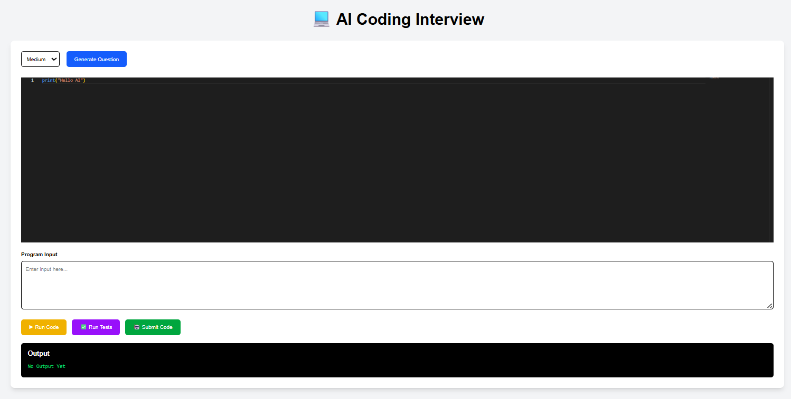
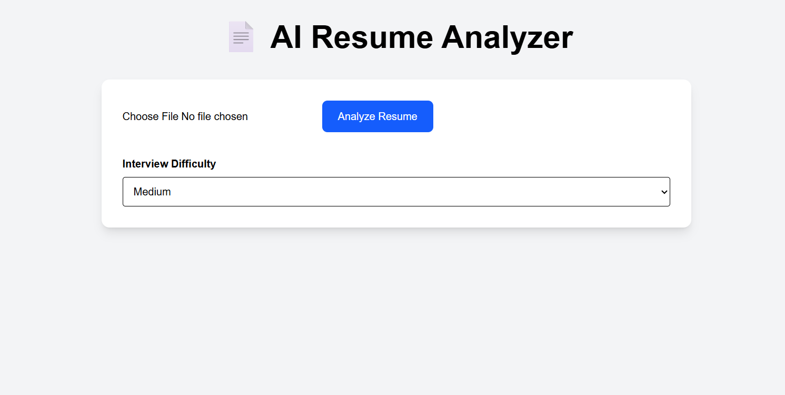

# 🤖 AI Interview Coach

> **An AI-powered interview preparation platform that helps students and job seekers improve their interview skills through AI mock interviews, resume analysis, coding assessments, and company-specific interview questions.**

---

## 🚀 Features

### 🔐 Authentication
- User Registration & Login
- JWT Authentication
- Protected Routes

### 🎤 AI Mock Interview
- AI-generated interview questions
- AI-based answer evaluation
- Performance scoring with detailed feedback

### 📄 Resume Analyzer
- Upload Resume (PDF)
- AI Resume Analysis
- Resume Improvement Suggestions
- Resume-based Interview Questions

### 💻 Coding Interview
- AI Coding Questions
- Monaco Code Editor
- Python Code Execution
- Custom Input Support
- Test Case Execution
- AI Code Evaluation

### 🏢 Company Interview
- Company-specific Interview Questions
- Role-based Questions
- Experience-based Questions
- Difficulty Levels

### 📊 Dashboard
- Interview History
- Coding Statistics
- Performance Charts
- Progress Tracking

---

# 🛠 Tech Stack

## Frontend
- React.js
- Vite
- Tailwind CSS
- Axios
- Monaco Editor
- Chart.js

## Backend
- FastAPI
- SQLAlchemy
- PostgreSQL (Neon)
- JWT Authentication
- Gemini API

## Database
- PostgreSQL (Neon)

---

# 📂 Project Structure

```text
AI-Interview-Coach
│
├── backend
│   ├── app
│   │   ├── database
│   │   ├── models
│   │   ├── routers
│   │   ├── schemas
│   │   ├── services
│   │   ├── utils
│   │   └── main.py
│   └── requirements.txt
│
├── frontend
│   ├── src
│   │   ├── components
│   │   ├── pages
│   │   ├── services
│   │   └── App.jsx
│   └── package.json
│
├── screenshots
└── README.md
```

---

# ⚙️ Installation

## Clone Repository

```bash
git clone https://github.com/aithavignesh/AI-Interview-Coach.git
```

## Backend

```bash
cd backend

python -m venv venv

venv\Scripts\activate

pip install -r requirements.txt

uvicorn app.main:app --reload
```

## Frontend

```bash
cd frontend

npm install

npm run dev
```

---

# 📸 Screenshots

## 🏠 Home



---

## 📊 Dashboard

## 📊 Dashboard



---

## 💻 Coding Interview

## 💻 Coding Interview



---


## 📄 Resume Analyzer

## 📄 Resume Analyzer



---

# 🎯 Future Improvements

- 🎤 Voice Interview
- 📹 Webcam Emotion Detection
- 🤖 AI Avatar Interviewer
- 📈 Weekly Performance Analytics
- 🏆 Leaderboard
- 🌙 Dark Mode
- 📧 Email PDF Reports
- 📱 Mobile Application

---

# 👨‍💻 Author

### **Vignesh Aitha**

- GitHub: https://github.com/aithavignesh
- LinkedIn: https://www.linkedin.com/in/vignesh-aitha-7046a734a/

---

## ⭐ Support

If you found this project useful, consider giving it a ⭐ on GitHub.
